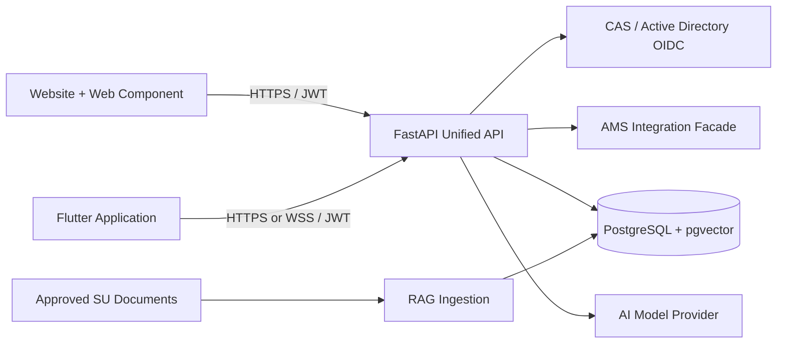

# Strathmore University Chatbot

An installable reference implementation of an AI-assisted academic advising and student-support platform for Strathmore University. One unified API serves a reusable Flutter module and a framework-independent web chat component.

Live demonstration: [su-chatbot-5tr4th.web.app](https://su-chatbot-5tr4th.web.app)

> The hosted preview currently uses clearly labelled fictional academic data. It is not connected to production AMS records, official fee ledgers, or approved university documents.

## What is included

- A responsive website preview with a floating, expandable chatbot.
- Firebase Email/Password authentication for Student and Staff demo accounts.
- Per-user conversation history in the browser preview.
- Role-aware answers using student programme/year or staff department context.
- Demonstration fee statements, timetables, available units, admissions guidance, and programme contacts.
- Voice-to-text input in supported browsers and Flutter devices.
- A reusable TypeScript web component with Markdown, citations, auto-scroll, and session restoration.
- A reusable Riverpod Flutter package with Markdown messages and speech input.
- A FastAPI REST/WebSocket backend designed for CAS/OIDC, AMS, PostgreSQL/pgvector, and RAG.
- Firebase Hosting and Cloud Run deployment configuration.
- Firebase Data Connect schema and administration operations.

## Architecture



The web and mobile clients are deliberately thin. Production model credentials, AMS credentials, institutional tokens, knowledge retrieval, and authorisation decisions belong only in the API.

## Repository layout

| Path | Purpose |
|---|---|
| `backend/` | FastAPI authentication, chat, RAG, persistence, AMS, and identity integrations |
| `web-widget/` | TypeScript web component and Firebase-hosted preview |
| `flutter_su_chatbot/` | Reusable Flutter/Riverpod chat module |
| `dataconnect/` | Firebase Data Connect schema, queries, and mutations |
| `deploy/` | Cloud Run deployment scripts and environment template |
| `docs/` | Architecture, deployment, operations, database, and remaining-input guides |
| `firebase.json` | Firebase Hosting, security headers, and deployment configuration |
| `docker-compose.yml` | Local PostgreSQL/pgvector and API environment |

## Prerequisites

Install the tools needed for the component you want to run:

- Git 2.40+
- Node.js 20+ and npm 10+
- Python 3.11+
- Docker Desktop, if running PostgreSQL locally
- Flutter 3.22+ and Dart 3.3+, if developing the mobile module
- Firebase CLI for hosting deployment
- A Firebase project with Hosting and Email/Password Authentication enabled

The preview can run without an AI key, AMS connection, or PostgreSQL database.

## Quick start: web preview

```powershell
git clone https://github.com/JoshuaOmond1/SU-Chatbot-project-.git
cd SU-Chatbot-project-
npm --prefix web-widget ci
npm --prefix web-widget run build
npm --prefix web-widget run preview
```

Open `http://127.0.0.1:4173`.

Useful web commands:

```powershell
npm --prefix web-widget run typecheck
npm --prefix web-widget run build
npm --prefix web-widget run preview
```

The TypeScript compiler generates versioned widget assets under `web-widget/public/chat-v*/`. These files are build output and are intentionally excluded from Git.

## Firebase Authentication setup

The hosted preview uses Firebase Email/Password Authentication. To use a different Firebase project:

1. Create a Firebase Web App.
2. Enable **Authentication → Sign-in method → Email/Password**.
3. Copy the Web App API key and project ID into `web-widget/public/auth.js`.
4. Add the deployed domain to Firebase Authentication's authorised domains.
5. Copy `.firebaserc.example` to `.firebaserc` and set your Firebase project ID.

The Firebase Web API key is public client configuration, not a server secret. Security must be enforced through authentication, backend authorisation, Firebase rules, App Check where applicable, and restricted Google API-key settings.

Student/Staff roles in the preview are self-selected and must not grant production privileges. Production staff access should be derived from CAS/Active Directory claims or server-issued Firebase custom claims.

## Demonstration data

The preview deliberately works without institutional systems:

- `web-widget/public/demo-academic-data.json` contains fictional fees, timetables, units, admissions steps, and contacts.
- `web-widget/public/demo-scenarios.json` contains general student-support knowledge examples.
- `web-widget/public/demo.js` provides the local conversation router and mock API responses.

All sample amounts, dates, rooms, phone numbers, email addresses, and academic records are labelled as demonstrations. Replace them with approved sources or authenticated AMS API responses before production use.

## Run the FastAPI backend

From PowerShell:

```powershell
cd backend
python -m venv .venv
.venv\Scripts\Activate.ps1
python -m pip install --upgrade pip
pip install -e ".[dev]"
Copy-Item .env.example .env
uvicorn app.main:app --reload
```

The API will be available at `http://127.0.0.1:8000`; interactive OpenAPI documentation is at `http://127.0.0.1:8000/docs`.

Development mode defaults to `USE_DATABASE=false`, allowing the API to start without PostgreSQL. Configure a model key only when testing live model responses.

### Run API and pgvector with Docker

```powershell
Copy-Item backend\.env.example backend\.env
docker compose up --build
```

This starts:

- PostgreSQL 16 with pgvector on port `5432`.
- FastAPI on port `8000`.
- The initial SQL migration from `backend/migrations/` when the database volume is first created.

Stop the services with `docker compose down`. Add `-v` only when you intentionally want to delete the local database volume.

## Backend environment variables

Copy `backend/.env.example` to `backend/.env`. Never commit the resulting `.env` file.

Important settings include:

| Variable | Purpose |
|---|---|
| `JWT_SECRET` | Signs short-lived assistant tokens in the reference HS256 flow |
| `ALLOWED_ORIGINS` | Explicit browser origins permitted by CORS |
| `USE_DATABASE` | Enables PostgreSQL persistence and retrieval |
| `DATABASE_URL` | Local PostgreSQL connection string |
| `OPENAI_API_KEY` | Optional model-provider credential |
| `OPENAI_CHAT_MODEL` | Chat model used by the AI service |
| `CAS_VALIDATE_URL` | CAS service-ticket validation endpoint |
| `OIDC_ISSUER` / `OIDC_JWKS_URL` | Active Directory or OIDC validation configuration |
| `AMS_BASE_URL` | Institution-owned AMS integration facade |
| `AMS_CLIENT_ID` / `AMS_CLIENT_SECRET` | Server-only AMS service credentials |

Use Secret Manager or another managed secret store in production. Never place these values in JavaScript, Flutter assets, URLs, logs, or Git.

## API surface

| Method | Route | Purpose |
|---|---|---|
| `GET` | `/v1/health` | Service liveness |
| `POST` | `/v1/auth/exchange` | Exchange CAS/OIDC credentials for a short-lived assistant JWT |
| `POST` | `/v1/sessions` | Create or resume a chat session |
| `GET` | `/v1/sessions/{id}` | Restore owner-scoped history |
| `POST` | `/v1/sessions/{id}/messages` | Send a question and receive an answer with citations |
| `WS` | `/v1/ws/sessions/{id}` | Stateful WebSocket chat |

## Flutter package integration

Add the package using a local path:

```yaml
dependencies:
  su_chatbot:
    path: ../flutter_su_chatbot
```

Or reference this Git repository:

```yaml
dependencies:
  su_chatbot:
    git:
      url: https://github.com/JoshuaOmond1/SU-Chatbot-project-.git
      path: flutter_su_chatbot
```

Configure it at the host application's authenticated boundary:

```dart
ProviderScope(
  overrides: [
    suChatConfigurationProvider.overrideWithValue(
      SuChatConfiguration(
        apiBaseUri: Uri.parse('https://your-api.example'),
        accessTokenProvider: authRepository.getAssistantAccessToken,
        initialSessionId: preferences.getString('su_chat_session'),
        onSessionChanged: (id) {
          preferences.setString('su_chat_session', id);
        },
      ),
    ),
  ],
  child: const MaterialApp(home: SuChatPage()),
)
```

For speech input, configure microphone and speech-recognition permissions:

- Android: `RECORD_AUDIO` in `AndroidManifest.xml`.
- iOS: `NSSpeechRecognitionUsageDescription` and `NSMicrophoneUsageDescription` in `Info.plist`.

The host application remains responsible for institutional authentication and secure token storage.

## Use the web component on another site

Build the widget, publish `web-widget/public/chat-v4/` and `su-chatbot-logo.png` on the target static asset domain, then mount it:

```html
<script type="module" src="/assets/su-chat/index.js"></script>

<su-chat
  id="student-assistant"
  api-base-url="https://your-api.example"
  label="SU Assistant">
</su-chat>

<script type="module">
  const chat = document.querySelector('#student-assistant');
  chat.tokenProvider = () => window.strathmoreAuth.getAssistantAccessToken();
  chat.setReady();
</script>
```

Serve the component over HTTPS with a strict Content Security Policy. Tokens should be short-lived and obtained from the host application's authenticated session; never store bearer tokens in local storage.

## Deploy Firebase Hosting

```powershell
npx firebase-tools login
Copy-Item .firebaserc.example .firebaserc
# Edit .firebaserc with your Firebase project ID
npx firebase-tools deploy --only hosting
```

`firebase.json` runs the widget build before deployment and applies security headers, CSP, cache policy, and browser permission restrictions.

## Deploy the API to Cloud Run

After configuring Google Cloud billing, Secret Manager, Cloud SQL, IAM, CAS/OIDC, and AMS variables:

```powershell
.\deploy\deploy-cloud-run.ps1
```

Review `docs/FIREBASE_DEPLOYMENT.md` and `docs/OPERATIONS.md` before using the deployment script. The current hosted page remains in preview mode until `web-widget/public/runtime-config.js` is configured for the live API.

## Verification commands

These commands validate source code without committing generated reports:

```powershell
# Backend
cd backend
python -m compileall app
ruff check app

# Web widget
cd ..
npm --prefix web-widget ci
npm --prefix web-widget run typecheck
npm --prefix web-widget run build

# Flutter package
cd flutter_su_chatbot
flutter pub get
flutter analyze
```

Generated caches, coverage, logs, compiled widget versions, and local test output are excluded by `.gitignore`.

## Production-readiness checklist

Before connecting real students or staff:

- Replace self-selected roles with CAS/AD-derived roles and immutable subject identifiers.
- Put an audited, least-privilege API facade in front of AMS; do not query AMS tables directly.
- Store secrets in Secret Manager and use managed identity where possible.
- Ingest only approved, versioned university documents with an owner and review date.
- Implement rate limiting, App Check/WAF controls, monitoring, retention, and deletion workflows.
- Keep fee transactions, grades, health/disability data, discipline data, and other sensitive fields out of model prompts unless explicitly approved.
- Complete accessibility, penetration, privacy/DPO, disaster-recovery, and RAG evaluation reviews.
- Clearly display sources, uncertainty, and human escalation paths.

## Additional documentation

- [Implementation plan](docs/IMPLEMENTATION_PLAN.md)
- [Firebase and Cloud Run deployment](docs/FIREBASE_DEPLOYMENT.md)
- [Database administration](docs/DATABASE_ADMIN.md)
- [Operations guide](docs/OPERATIONS.md)
- [Remaining institutional inputs](docs/REMAINING_INPUTS.md)
- [Backend notes](backend/README.md)
- [Flutter package notes](flutter_su_chatbot/README.md)
- [Web component notes](web-widget/README.md)

## Project status

The web preview and Firebase Authentication are deployed. The production RAG backend, official document corpus, CAS/Active Directory, AMS facade, Cloud SQL runtime, and institutional approval workflow still require university-owned credentials, contracts, data, and governance sign-off.
