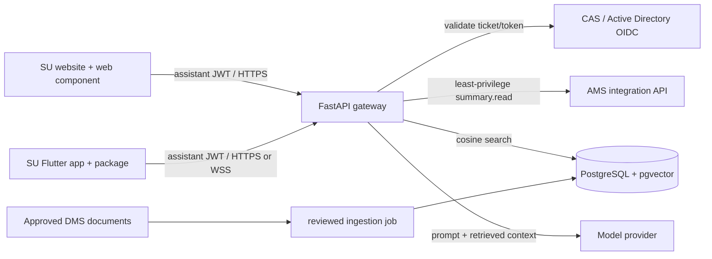

# SU Assistant implementation plan

## 1. Target architecture

Both user interfaces are deliberately thin. They render chat, request a short-lived
assistant token from their existing authenticated host, and call the same versioned
API. Only the API can read approved knowledge, call the model provider, or obtain an
AMS service token.

Recommended production zones:

- Public edge: WAF/API gateway, TLS termination, origin allow-list, request-size and
  per-subject rate limits.
- Application zone: two or more stateless API replicas; secrets from a managed
  vault; outbound allow-list limited to identity, AMS, model, and telemetry services.
- Data zone: private PostgreSQL/pgvector with encryption at rest, point-in-time
  recovery, row-level ownership checks, and no public route.
- Integration zone: an institution-owned AMS facade exposing task-specific response
  models rather than direct database access.

## 2. End-to-end identity and session flow

1. The existing website or Flutter app authenticates the student through its normal
   CAS/AD flow.
2. The host obtains a one-time CAS service ticket or institution-issued OIDC token.
3. It calls `POST /v1/auth/exchange`. The API verifies the credential against CAS or
   AD JWKS, maps immutable subject and student ID claims, and issues a 15-minute JWT
   for audience `su-assistant-clients`.
4. The widget/package creates a chat session. Every read/write includes the JWT; the
   repository always queries by both session ID and owner subject.
5. Clients refresh the assistant token through the host authentication layer. They
   never receive the AMS client credential or model API key.

For stronger production isolation, replace the reference HS256 assistant JWT with
asymmetric signing through the university KMS and publish a rotated JWKS. Apply
revocation/reauthentication policy from the central identity platform.

## 3. RAG request lifecycle

1. Validate the message length and authenticated principal; rate-limit on subject,
   IP, and route.
2. Create an embedding for the question and retrieve the top approved, active chunks
   filtered by audience. Apply score thresholds and `valid_from`/`valid_until` in the
   production query.
3. Request the student's narrow AMS summary only when personalised context is useful.
   The supplied facade allow-lists programme, year, registration state, and a fee
   balance band. Raw financial transactions, grades, medical/disability information,
   disciplinary records, and other students' records are excluded.
4. Supply recent conversation, authorised snapshot, and retrieved chunks to the model.
   The system prompt treats retrieved content as untrusted data and requires citations.
5. Persist the user and assistant messages plus source IDs. Return structured citations
   so UI clients do not have to parse model text to discover sources.

Answers about a student's exact fee ledger, marks, registration changes, or workflow
actions should be separate deterministic tools/endpoints with explicit confirmation,
not generated from RAG text. The current AMS adapter is read-only by design.

## 4. Knowledge governance

Knowledge sources should come from the university document management system, not an
unreviewed web crawl. Assign an owner and review date to each source:

| Domain | Authoritative owner | Refresh trigger | Examples |
|---|---|---|---|
| Fees | Finance Office | approved fee schedule | fee policy, payment channels |
| Academic | Registrar / faculties | senate approval | handbook, progression rules |
| Courses | Academic departments | curriculum publication | catalogues, prerequisites |
| Student support | Student Services | service change | counselling, accessibility, contacts |

Ingestion stages are export, malware scan, text extraction/OCR, metadata validation,
chunk/embedding, human preview, then publish. A new document version should deactivate
the prior chunks atomically. Store checksum, canonical URL, validity window, owner,
classification, and approval record. Run retrieval regression questions before publish.

The included CLI ingests reviewed UTF-8 Markdown/text exports. Production should wrap
it in a job that records approvals and supports PDF/DOCX extraction; do not let public
users invoke ingestion.

## 5. API contract

| Method | Route | Purpose |
|---|---|---|
| `POST` | `/v1/auth/exchange` | exchange one-time CAS ticket or AD/OIDC token |
| `POST` | `/v1/sessions` | create or idempotently resume a client-selected session |
| `GET` | `/v1/sessions/{id}` | restore owner-scoped history |
| `POST` | `/v1/sessions/{id}/messages` | send message and receive cited answer |
| `WS` | `/v1/ws/sessions/{id}` | stateful low-latency exchange |
| `GET` | `/v1/health` | shallow liveness check |

For WebSockets the token is carried as the second `Sec-WebSocket-Protocol` value
(`su-chat,bearer.<JWT>`), not in a query parameter. At an ingress proxy, redact this
header and all authorization headers from logs.

Before public launch, add `/ready` dependency checks, OpenAPI contract version tests,
refresh-token/reauthentication handling, bounded retry/circuit breakers for AMS and
the model, and Redis-backed distributed rate limiting.

## 6. AMS coordination

Do not connect the assistant directly to AMS tables. Place a stable facade owned by
the AMS team in front of them:

- OAuth2 client credentials or mTLS for the assistant service identity.
- Scope `assistant.summary.read`, constrained to the authenticated student's mapped
  identifier; deny arbitrary student search.
- Field-level response allow-list and purpose-based audit entry containing actor,
  fields accessed, correlation ID, outcome, and timestamp.
- Five-second timeout, circuit breaker, and graceful generic answers when unavailable.
- No AMS payload in application logs or analytics. Minimise what is sent to the model.

Reconcile CAS/AD subject-to-AMS ID mapping in the identity service, not from user input.
If mapping is absent or ambiguous, omit personalisation and direct the user to support.

## 7. Security and privacy controls

- HTTPS/WSS only, HSTS, strict CSP for the website, explicit CORS origins (never `*`
  with credentials), WAF rules, schema validation, and 4 KB message limit.
- Secrets in a vault; managed identity where possible; quarterly rotation; no secrets
  in Flutter assets, JavaScript bundles, `.env` commits, or logs.
- PII minimisation, documented retention (for example 30–90 days), student deletion/
  access process, encrypted backups, and Kenya Data Protection Act review by the DPO.
- Prompt-injection tests, retrieval poisoning controls, source approval, output checks,
  model-provider data processing terms, and an incident kill switch.
- Clear disclosure that the assistant may be wrong, source links, escalation contacts,
  crisis/safeguarding routing, and no autonomous academic or financial decisions.
- Audit administrative knowledge changes and AMS access. Keep security audit data
  separate from conversational analytics.

## 8. Observability and evaluation

Propagate a generated correlation ID through API, AMS, retrieval, and model calls.
Record latency, HTTP outcome, token usage, retrieval IDs/scores, fallback rate, and
user feedback—never raw tokens or unrestricted AMS data. Alert on authentication
failures, AMS/model error spikes, empty retrieval, latency SLO breach, and unusual
per-subject volume.

Maintain a de-identified evaluation set across fees, course rules, academic advising,
ambiguous questions, prompt attacks, out-of-scope requests, and emergency language.
Gate releases on citation precision, groundedness, refusal correctness, retrieval
recall, accessibility, and p95 latency. Academic/Finance owners sign off their domains.

## 9. Delivery phases

1. **Foundation (2–3 weeks):** confirm CAS/OIDC and AMS contracts, DPO/security review,
   environments, secrets, PostgreSQL, CI, and canonical source owners.
2. **Pilot (3–5 weeks):** ingest a limited approved corpus, deploy API, integrate both
   clients, add telemetry/rate limits, and run staff/student usability and accessibility
   testing with synthetic/non-production AMS data.
3. **Controlled release (2–4 weeks):** one faculty or service domain, human escalation,
   daily answer review, retrieval/model evaluation, and operational runbooks.
4. **Scale:** add domains only after owner sign-off, automate governed ingestion,
   introduce multilingual evaluation if required, perform penetration testing and
   disaster-recovery exercises, then establish quarterly policy/model reviews.

## 10. Definition of done

- Unit, integration, contract, RAG evaluation, widget browser, and Flutter device tests
  pass in CI; critical flows work with AMS/model dependencies degraded.
- No client bundle contains institutional or model secrets; token/session ownership and
  IDOR tests pass; logs are verified free of tokens and restricted student fields.
- WCAG 2.2 AA review completed for web and mobile, including keyboard, screen reader,
  contrast, text scaling, reduced motion, and voice-permission denial.
- Finance, Registrar, Student Services, AMS team, security, DPO, and support operations
  approve content, access, retention, escalation, and rollback procedures.
